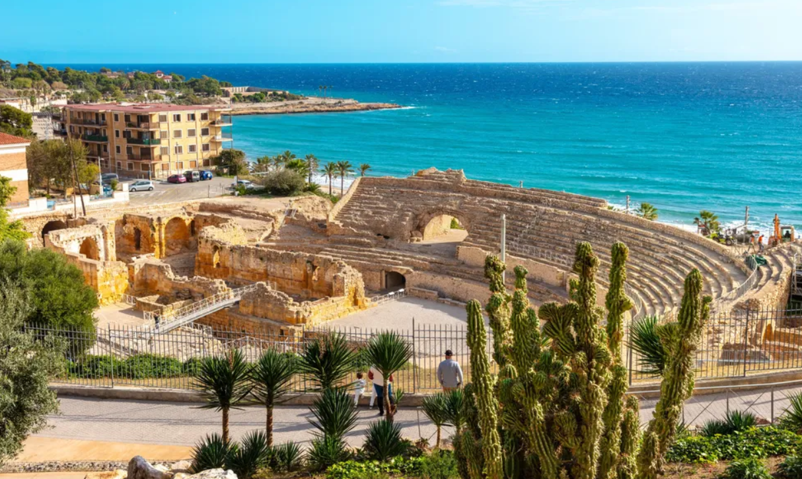

# **Projecte TGN Outdoor Fitness 🏃‍♀️🌳**

El projecte **TGN Outdoor Fitness** té com a objectiu fomentar l'activitat física a l'aire lliure a Tarragona, aprofitant els espais naturals i urbans de la ciutat per crear circuits d'entrenament funcional accessibles a tothom. A través de l'anàlisi geogràfica i la planificació urbana, el projecte busca millorar la salut i el benestar dels habitants de la ciutat, oferint rutes i espais pensats per a la pràctica de l'esport a l'exterior.

Aquest projecte es basa en la geografia urbana i la seva capacitat per facilitar l'accés a espais d'activitat física, millorant la qualitat de vida dels ciutadans mitjançant l'ús sostenible dels espais públics. La web ofereix informació sobre els circuits, els membres de l'equip i els objectius del projecte, així com la possibilitat de contactar directament amb l'equip per a més informació o col·laboracions.

---

## **Dades/Continguts 📋**

### Fonts de dades

El contingut de la pàgina web ha estat basat en diverses fonts oficials i acadèmiques, com ara:

1. **Ajuntament de Tarragona**: S’ha obtingut informació sobre els espais verds i els recursos urbans disponibles per a la pràctica de l'activitat física.
2. **Portal Meteorològic**: S’ha utilitzat per proporcionar dades sobre el temps a Tarragona, essencials per a l'activitat física a l'aire lliure.
3. **Fonts visuals**: Les imatges de la pàgina web provenen de recursos propis, així com de recursos públics lliures de drets d'autor, amb l'objectiu de representar de manera fidel els espais disponibles per a l'activitat física i els membres del projecte.

### Imatges 📸

Les imatges que apareixen al lloc web representen tant els espais físics de Tarragona com els membres del projecte. Aquestes són algunes de les imatges destacades:

- **Logo del projecte**:

  

- **Imatge destacada de la secció de mapa**:

  

- **Membre 1**:

  

---

## **Estructura de la Web 🧭**

La web del projecte **TGN Outdoor Fitness** està dissenyada per ser clara, funcional i fàcil d'usar. La pàgina web es divideix en les següents seccions clau:

### 1. **Inici**:
   - Aquesta secció proporciona una visió general del projecte, amb una introducció als objectius generals, la motivació darrere de la creació del projecte i la seva importància per a la salut pública a Tarragona.

### 2. **Membres**:
   - Aquesta secció presenta els membres de l’equip responsable del projecte. Els usuaris poden conèixer més sobre les persones que han dissenyat i gestionen les iniciatives d'activitat física a Tarragona, així com la seva experiència en el camp de la geografia urbana i l’esport.

### 3. **Projecte**:
   - La secció detalla els objectius del projecte, així com les estratègies utilitzades per analitzar i dissenyar les rutes d'entrenament funcional a Tarragona. S’explica com la ciutat es pot beneficiar d’aquestes rutes i circuits, millorant l’accés a espais d’entrenament lliures i oberts.

### 4. **Mapa**:
   - En aquest apartat (encara en desenvolupament), es mostrarà un mapa interactiu amb la localització de les zones d'activitat física. Els usuaris podran veure les ubicacions d'interès on poden realitzar activitats físiques a l'aire lliure, així com obtenir més informació sobre cadascun dels espais.

### 5. **Contacte**:
   - La secció de contacte permet als usuaris posar-se en contacte amb els responsables del projecte per a més informació, suggeriments o col·laboracions. A través d'un formulari senzill, els usuaris poden enviar els seus missatges directament a l'equip del projecte.

---

## **Web responsive 📱**

Per garantir que la pàgina web sigui compatible amb tots els dispositius, s'ha aplicat un disseny **responsive** mitjançant tècniques com:

1. **Media Queries**:
   - A través de les *media queries* de CSS, la pàgina es redimensiona per adaptar-se a les diferents mides de pantalla. Això permet una visualització correcta en dispositius mòbils, tauletes i ordinadors de sobretaula.

Exemple de codi CSS utilitzat per a dispositius mòbils:
```css
@media screen and (max-width: 768px) {
  .projecte-titol h1 {
    font-size: 1.5rem;
  }
}


