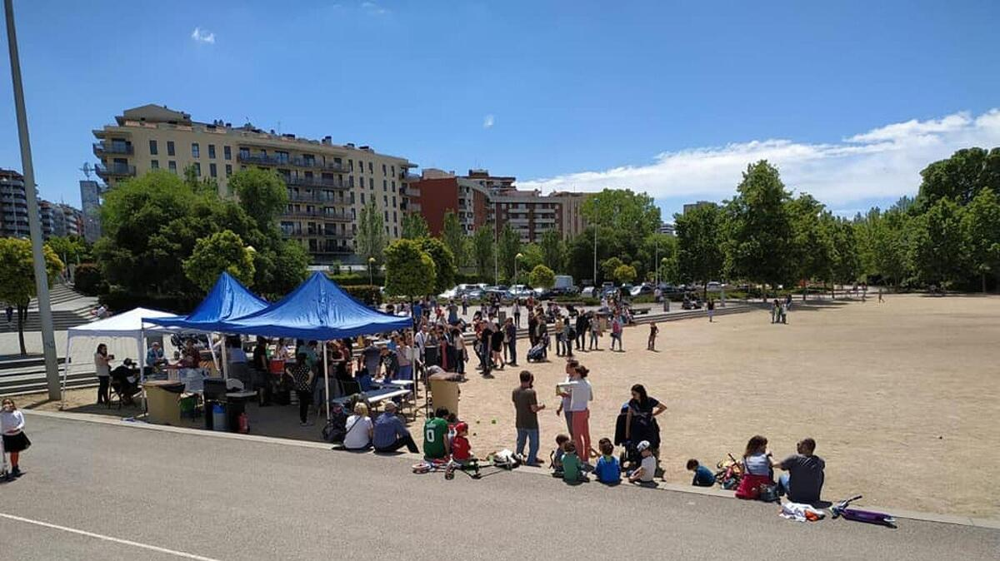
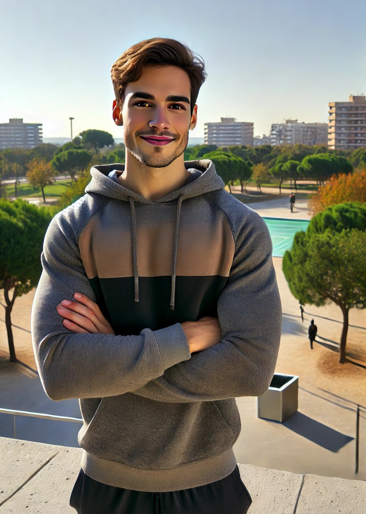

# **Projecte TGN Outdoor Fitness 🏃‍♀️🌳**

El projecte **TGN Outdoor Fitness** té com a objectiu fomentar l'activitat física a l'aire lliure a Tarragona, aprofitant els espais naturals i urbans de la ciutat per crear circuits d'entrenament funcional accessibles a tothom. A través de l'anàlisi geogràfica i la planificació urbana, el projecte busca millorar la salut i el benestar dels habitants de la ciutat, oferint rutes i espais pensats per a la pràctica de l'esport a l'exterior.

Aquest projecte es basa en la geografia urbana i la seva capacitat per facilitar l'accés a espais d'activitat física, millorant la qualitat de vida dels ciutadans mitjançant l'ús sostenible dels espais públics. La web ofereix informació sobre els circuits, els membres de l'equip i els objectius del projecte, així com la possibilitat de contactar directament amb l'equip per a més informació o col·laboracions.


## **Dades/Continguts 📋**

### 1) Motivació

Sóc una ciutadana de Tarragona que vol aprofitar i millorar els espais verds que tenim per practicar esports a l'aire lliure. La ciutat de Tarragona compta amb una gran varietat d’espais naturals i zones verdes que poden ser perfectament aprofitades per a la pràctica de l'activitat física, com caminar, córrer o fer exercicis de força. Em sembla fonamental promoure la utilització d'aquests espais per millorar la salut i el benestar de la població, en un entorn natural i saludable. Amb aquesta iniciativa, espero contribuir al foment d'un estil de vida actiu i una ciutat més sana, tot potenciant el seu patrimoni natural i la seva sostenibilitat ambiental. 

Aquesta proposta no només vol donar a conèixer els espais verds, sinó també sensibilitzar la ciutadania de la importància de cuidar i mantenir aquests espais per tal de seguir gaudint-ne en el futur. A través d'aquest projecte, vull donar veu a una activitat que ens beneficia a tots com a societat i que pot transformar la manera en què vivim la nostra ciutat.

### 2) Fonts de dades

Per recollir la informació necessària per a aquest projecte, s'han utilitzat diverses fonts oficials i acadèmiques. Entre les fonts més destacades, es troben:

- **Ajuntament de Tarragona**: S'ha obtingut informació sobre els espais verds i recursos urbans, així com les característiques i l'estat de les zones d'entrenament disponibles a la ciutat.
- **Portal Meteorològic**: Dades sobre el clima de Tarragona, essencials per garantir que els circuits siguin aptes per a la pràctica de l'esport en diferents condicions meteorològiques.
- **QGIS**: Eina utilitzada per digitalitzar les localitzacions dels espais verds i per analitzar-los geogràficament, facilitant la creació del mapa interactiu.

### 3) Imatges:

#### 3.1 Ús d'imatges originals

Per garantir la legalitat i l'ús ètic de totes les imatges d'aquesta pàgina web, era imprescindible complir amb les normatives de drets d'autor i les llicències d'ús. Com a resultat, es va decidir utilitzar imatges exclusivament originals. Això inclou tant imatges per a aquest projecte com altres escollides específicament per a la pàgina web, que ofereixen una representació directa dels espais.

 


#### 3.2 Imatges generades amb IA

S'ha fet servir també imatges generades amb intel·ligència artificial (IA) per poder facilitar la visualització i crear imatges de membres per il·lustrar el projecte. Aquestes imatges s'han creat per oferir una millor comprensió visual de l'equip darrere del projecte i de la seva tasca.



#### 3.3 Logo creat amb BandCrowd

El **logo** de **TGN Outdoor Fitness** ha estat creat utilitzant l'eina **Logo Creator** de la pàgina web **BandCrowd**. Aquesta eina ha permès crear un disseny professional i modern per a representar la imatge del projecte. El logo simbolitza l'activitat a l'aire lliure i la connexió amb la natura que caracteritza aquest projecte.


## **Estructura de la web 🔗**

La pàgina web del projecte **TGN Outdoor Fitness** està dissenyada per ser clara, intuïtiva i funcional, amb un enfocament principal en la facilitat d'ús i l'accés a la informació. La web es divideix en diverses seccions clau que permeten als usuaris navegar fàcilment i trobar el que busquen. A continuació, es detallen les parts més importants de la pàgina web:

### 1) **Inici**
   - La pàgina **Inici** ofereix una visió general del projecte, amb una breu descripció dels seus objectius i la seva motivació. Aquesta secció introdueix als usuaris a **TGN Outdoor Fitness** i destaca la importància de fomentar l'activitat física a l'aire lliure aprofitant els espais verds de Tarragona.
   - Conté també enllaços ràpids a les altres seccions de la web, facilitant la navegació.

### 2) **Membres**
   - La secció **Membres** presenta els membres de l’equip que gestionen i duen a terme el projecte. Els usuaris poden conèixer les persones responsables del disseny dels circuits i activitats físiques a Tarragona. Això inclou informació sobre les seves qualificacions i rols dins del projecte.
   - Aquesta secció utilitza imatges generades amb IA, com les de **fondo-membres** i **membre4**, per representar els membres de l'equip de manera visual.

### 3) **Projecte**
   - A la secció **Projecte** es detallen els objectius i les estratègies del projecte, així com la manera en què es dissenyaran i implementaran els circuits d'entrenament a l'aire lliure. També s'inclou informació sobre les possibles millores que es poden fer als espais verds de la ciutat.
   - Aquesta secció és una de les més importants, ja que permet als usuaris entendre l'impacte del projecte en la comunitat de Tarragona i la seva finalitat.

### 4) **Mapa**
   - La secció **Mapa** ofereix un mapa interactiu de Tarragona que mostra les localitzacions dels espais verds i circuits d’entrenament disponibles. Els usuaris poden veure les zones on poden realitzar activitats físiques a l'aire lliure, així com obtenir més informació sobre cada espai.
   - Aquest mapa es genera mitjançant **Leaflet.js** i **QGIS** i s’actualitza en temps real amb les noves localitzacions que es vagin incorporant al projecte.

### 5) **Contacte**
   - La secció **Contacte** permet als usuaris posar-se en contacte amb els responsables del projecte per a més informació o per fer suggeriments i col·laboracions. Aquesta secció inclou un formulari senzill per enviar missatges directes a l'equip, així com les dades de contacte.
   - És important que aquesta secció estigui accessible per tal que qualsevol persona interessada pugui comunicar-se fàcilment amb l'equip del projecte.


La web està dissenyada seguint els principis de **simplicitat** i **accessibilitat**, amb una estructura que facilita la navegació, a més d'optimitzar-se per a dispositius mòbils per garantir una bona experiència d'usuari a totes les plataformes.


## **Web responsive 📱💻**

El disseny **responsive** de la pàgina web és fonamental per garantir que els usuaris tinguin una experiència òptima en dispositius de totes les mides. Això s'aconsegueix mitjançant l'ús de **media queries** i tècniques com **Flexbox**, que adapten el contingut a la mida de la pantalla del dispositiu que s'estigui utilitzant. La web ha estat dissenyada per assegurar que el contingut sigui fàcil de llegir i d'interactuar en mòbils, tauletes i ordinadors de sobretaula.

### Tècniques utilitzades

1. **Media Queries**: Aquesta tècnica permet canviar l'estil de la pàgina depenent de la mida de la pantalla, assegurant que els elements es redimensionin adequadament en dispositius més petits, com els mòbils.

2. **Flexbox**: S'ha utilitzat **Flexbox** per gestionar la distribució dels elements dins de contenidors. Aquesta tècnica permet que els elements es redistribueixin de manera flexible segons la mida de la pantalla.

### Exemple de codi CSS per a **media queries**:

Aquest codi s'utilitza per ajustar el disseny de la pàgina quan es visualitza en dispositius més petits. Per exemple, el títol de la secció **Projecte** s'escala per a ajustar-se millor a pantalles petites.

```css
/* Ajust de títols en pantalles petites */
@media screen and (max-width: 768px) {
    .projecte-titol h1 {
        font-size: 1.5rem; /* Reduir la mida de la lletra del títol */
    }
}
```
Pel que fa al "flexbox", és un model de disposició responsive de css que permet que els elements dins d'un contenidor es disposen automàticament segons la mida de la pantalla. Exemple:

**Reajustament flexbox d'un contenidor**. 
```css
/* Estils per als contenidors principals */
.container {
  padding: 78px;
  display: flex;
  flex-wrap: wrap;
}
```

###Exemple de codi CSS per al **menú mòbil**:

Aquest codi gestiona el menú de navegació per a dispositius mòbils, on es mostra un botó de menú desplegable que, quan es clica, mostra les opcions disponibles. Això ajuda a mantenir la pàgina neta i fàcil de navegar a pantalles petites.

```css
@media screen and (max-width: 768px) {
    .menu {
        display: none;  /* Ocultar el menú en dispositius petits */
    }
    #menu:checked + label + .menu {
        display: block; /* Mostrar el menú quan el checkbox està marcat */
    }
    .menu-icono {
        cursor: pointer;
    }
}
```
A més de l'ús de CSS, també s'ha utilitzat JavaScript per millorar l'adaptabilitat de la pàgina web en certs aspectes, com la barra de navegació. En dispositius petits, el menú es transforma en un botó o icona que, en prémer-lo, expandeix les opcions del menú, en lloc de mostrar-les de manera permanent com en les pantalles grans.


## **Parts rellevants ‼️**

A continuació es detallen algunes de les parts més rellevants de la pàgina web **TGN Outdoor Fitness**, amb exemples de codi HTML i CSS extrets del fitxer zip.

### **1. Barra de navegació**

La **barra de navegació** és un element essencial per a la pàgina web, ja que facilita l'accés a les diferents seccions del lloc. Aquesta barra es manté fixa a la part superior de la pàgina i canvia el seu disseny en funció de la mida de la pantalla, adaptant-se a dispositius mòbils i d'escriptori. En dispositius més petits, el menú es converteix en un botó desplegable.

#### Exemple de codi HTML per a la barra de navegació:
```html
<header> 
    <div class="header-left">
        
        <span class="titulo">TGN Outdoor Fitness</span>
    </div>

    <input type="checkbox" id="menu" />
    <label for="menu">
        
    </label>

    <ul class="menu">
        <li class="item"><a href="index.html">Inici</a></li>
        <li class="item"><a href="membres.html">Membres</a></li>
        <li class="item"><a href="projecte.html">Projecte</a></li>
        <li class="item"><a href="mapa.html">Mapa</a></li>
        <li class="btn"><a href="contacte.html">Contacte</a></li>
    </ul>
</header>
```

####Exemple de codi CSS per a la barra de navegació:
```css
/* Menú Desplegable per a dispositius mòbils */
@media screen and (max-width: 768px) {
    .menu {
        display: none;  /* Ocultar el menú en dispositius petits */
    }
    #menu:checked + label + .menu {
        display: block; /* Mostrar el menú quan el checkbox està marcat */
    }
    .menu-icono {
        cursor: pointer;
    }
}
```

### **2. Icona light/dark

La pàgina inclou una icona de canvi de mode que permet als usuaris alternar entre el mode clar i el mode fosc. Aquesta funcionalitat es gestiona a través de JavaScript, i els estils s'apliquen amb CSS per modificar els colors de fons i text en funció del mode seleccionat.

####Exemple de codi JavaScript per a la icona light/dark:
```js
const toggle = document.getElementById('theme-toggle');
toggle.addEventListener('change', () => {
    document.body.classList.toggle('dark', toggle.checked);
});
```

####Exemple de codi CSS per al mode fosc/clar:
```css
/* Estils per al mode fosc */
body.dark {
    background-color: #121212;
    color: #ffffff;
}

/* Estils per al mode clar (per defecte) */
body {
    background-color: #ffffff;
    color: #000000;
}
```

### **3. Mapa interactiu

Una altra part rellevant de la pàgina és el mapa interactiu, que permet als usuaris veure les ubicacions dels espais verds i circuits d’entrenament a Tarragona. Es fa servir la biblioteca Leaflet.js per generar el mapa i mostrar-lo a la pàgina web. Els usuaris poden interactuar amb el mapa, visualitzant les ubicacions i les rutes per fer exercici a l'aire lliure.


## **Cartografia 📌**

La **cartografia** és una part fonamental del projecte **TGN Outdoor Fitness**, ja que permet als usuaris explorar els espais verds i circuits d’entrenament disponibles a Tarragona de manera visual i interactiva. A través del mapa, els usuaris poden veure la ubicació exacta de les zones on poden realitzar activitats físiques a l'aire lliure, així com obtenir informació addicional sobre cada espai.

### Eines utilitzades per a la cartografia

Per a la creació i visualització dels mapes s'ha utilitzat el següent:

1. **QGIS**: Aquesta eina ha estat utilitzada per digitalitzar els espais verds i identificar els punts d'interès per a les activitats físiques. A partir de QGIS, s'han generat les capes de dades que representen els espais disponibles a Tarragona.

2. **Leaflet.js**: Aquesta biblioteca JavaScript s'ha utilitzat per integrar els mapes a la pàgina web. Leaflet permet crear mapes interactius que els usuaris poden explorar, amb funcionalitats com a marcadors per indicar les localitzacions d'interès i finestres emergents amb més informació sobre cada espai.

### Exemples de funcionalitats del mapa

- **Visualització d'espais verds**: Els usuaris poden veure les ubicacions dels espais verds i circuits d’entrenament a Tarragona, permetent-los planificar les seves activitats físiques.
- **Interactivitat**: Els usuaris poden fer clic en els marcadors del mapa per veure més detalls sobre cada espai, com ara el nom, la descripció i les condicions de l’espai.
- **Actualització en temps real**: El mapa es manté actualitzat amb les noves localitzacions que es vagin afegint al projecte, de manera que sempre reflecteixi les opcions disponibles per a la pràctica esportiva a l'aire lliure.

### Exemple de codi HTML per al mapa:
```html
<div id="map" style="height: 500px;"></div>
```

### Exemple de codi JavaScript per integrar un mapa de Leaflet:
```js
var map = L.map('map').setView([41.1187, 1.2445], 13);  // Centrat a Tarragona

L.tileLayer('https://{s}.tile.openstreetmap.org/{z}/{x}/{y}.png', {
    attribution: '&copy; <a href="https://www.openstreetmap.org/copyright">OpenStreetMap</a> contributors'
}).addTo(map);

// Afegir un marcador al mapa
var marker = L.marker([41.1187, 1.2445]).addTo(map);
marker.bindPopup('<b>Espai Verd 1</b><br>Una zona excel·lent per entrenar').openPopup();
```

## **Dificultats/millores 🛠️**

### Dificultats trobades

1. **Implementació del mode fosc/clar**:
   La implementació del mode fosc i clar va ser un repte, ja que calia garantir que aquest canvi fos persistent entre les pàgines i que l'usuari pogués canviar entre els dos modes de manera senzilla. Això va requerir l'ús de JavaScript per gestionar l'intercanvi de classes i el guardat de preferències a l'emmagatzematge local del navegador.

2. **Optimització per a mòbils**:
   Tot i que la pàgina és responsive, hi va haver certs elements del disseny que requerien ajustos específics per a dispositius mòbils. Això inclou el redisseny del menú i la visualització del mapa en pantalles més petites. L'adaptació dels continguts per garantir una bona experiència d'usuari en dispositius de totes les mides va ser una tasca que va necessitar diverses proves i ajustaments.

### Millores futures

1. **Accés multilingüe**:
   Afegir més opcions de traducció per permetre als usuaris gaudir del contingut en altres idiomes, millorant l'accessibilitat del projecte a una audiència més àmplia. Això ajudaria a que la pàgina fos més inclusiva i accessible per als usuaris de diferents orígens.

2. **Integració de mapes interactius més avançats**:
   Es podrien afegir funcions més avançades als mapes, com la possibilitat de marcar rutes personalitzades o veure l'estat dels espais verds en temps real, millorant l'experiència de l'usuari. També s'inclourien funcions com filtres per cercar espais específics segons les necessitats de l'usuari (per exemple, zones amb ombra, àrees més grans, etc.).

3. **Millorar l'accessibilitat**:
   Afegir més funcionalitats per millorar l'accessibilitat, com l'ajust de la mida del text o el contrast dels colors per a persones amb discapacitat visual. Això garantiria que la web sigui usable per a un públic més divers.


## **Autor ✒️**

* **Diana Maria Giurgiu** - (dianamaria.giurgiu@estudiants@urv.cat) 


## **Agraiments 🎁**

1. **Carlos Soriano** - *Professor de l'assignatura d'eines web*
2. **Benito Zaragozí** - *Professor de l'assignatura d'eines web*

